# 06_Proj 1 - APIs: Marvel Media (Explanation ReadMe)

Link to Website: https://tloyzelle.github.io/Project-Marvel/

1. 2 server-side APIs

- Marvel API:

  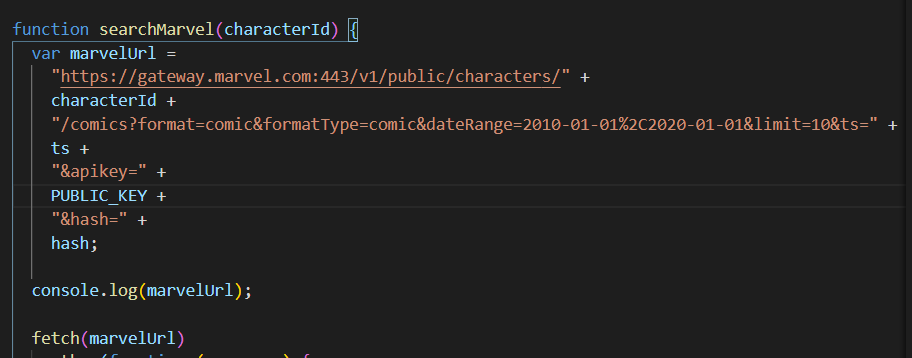

- OMDB API:

  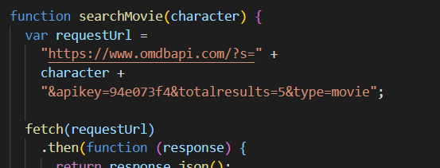

2. CSS framework (no bootstrap)

- Clean style coding:

  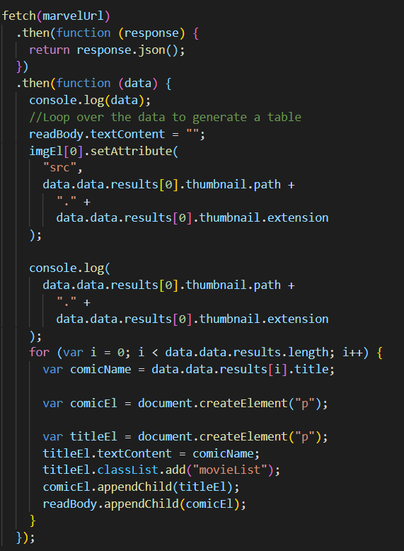
  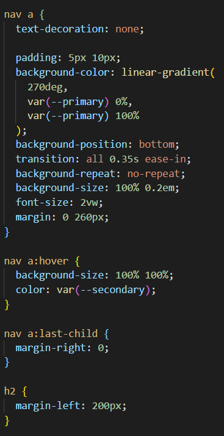
  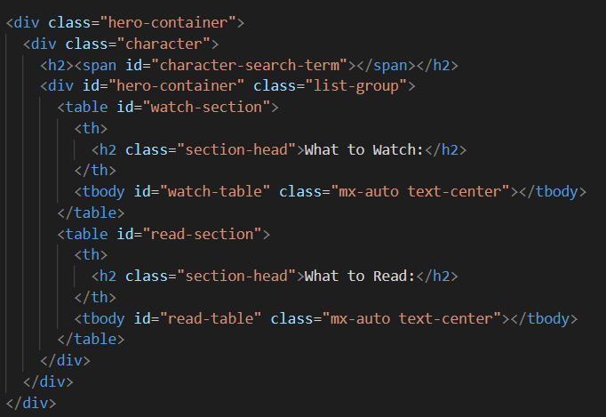

3. Use local storage

- Local Storage coding:

  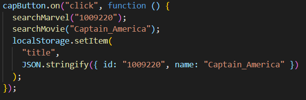

- Persistent Application Memory:

  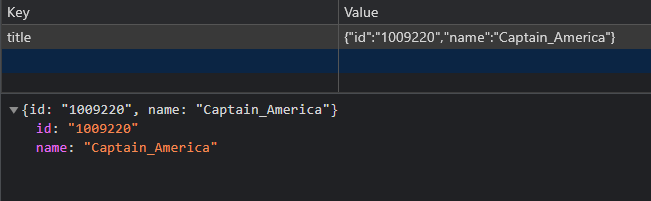

4. Mobile UI

- Media Query:

  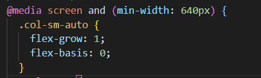
  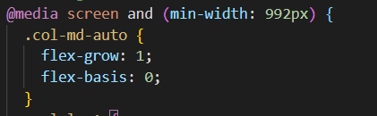

5. No alerts

- Photo not found (because we didn't have any.)

6. Interactive

- Buttons:

  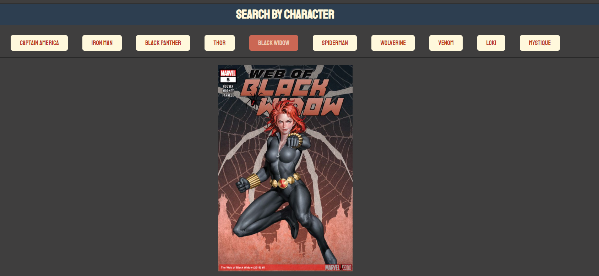

- User controlled variable generation:

  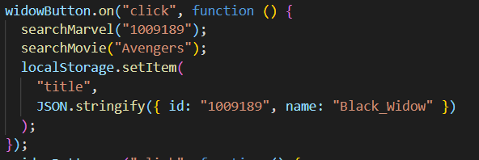
